# ModernBoxes(木函)

##  什么是木函

​		在日常的工作或学习中，难免会有一些临时的文件夹，文件，应用，出现在你的桌面，但是呢你又不确定它是不是哪一天会突然用到，这样一天又一天，直至你的电脑桌面是一片狼藉，满屏的文件，文件夹，应用，当打开桌面的那一刻便没有心情再去工作学习了。

## 木函可以干什么

​		而木函正是为此而生，它可以帮助你更好的管理你的桌面，使你将你的文件，文件夹，应用分门别类的管理，在寻找文件的时候可以快速的找到，而不是盯着满屏的图标挨个寻找，这样节约了我们大量的时间，从而可以更加高效的投身于学习和工作当中。

## 运行环境

* 操作系统：Windows8及以上，win11效果更加
* 程序运行环境：.NET 5

## 简单的效果图

#### 将木函固定到桌面上

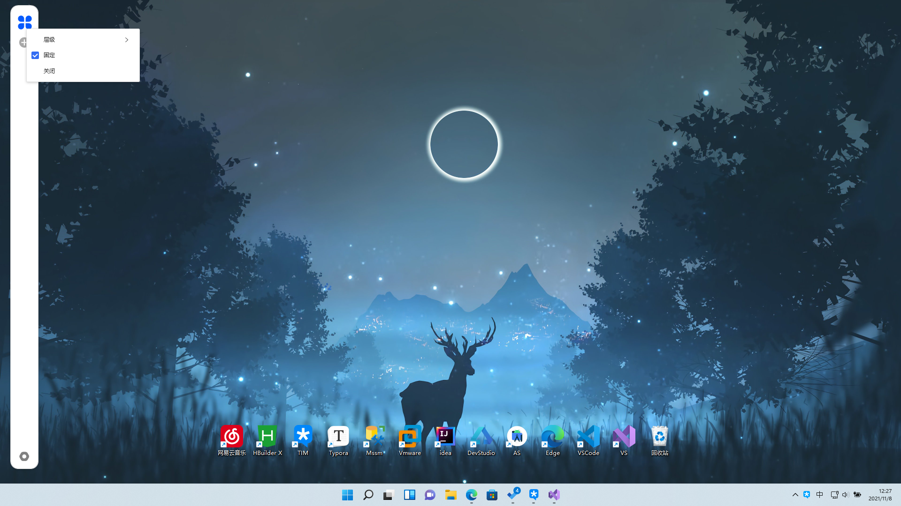

#### 添加组件应用

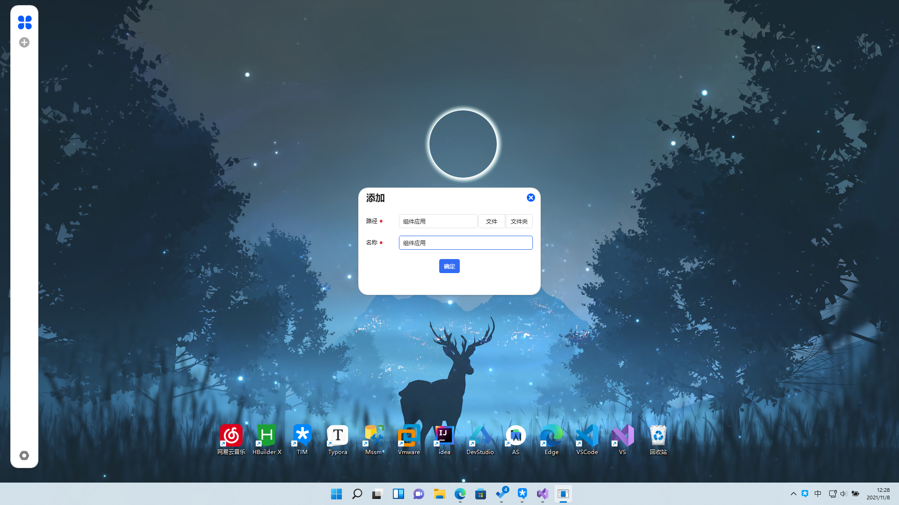

点击确定后即可添加组件应用

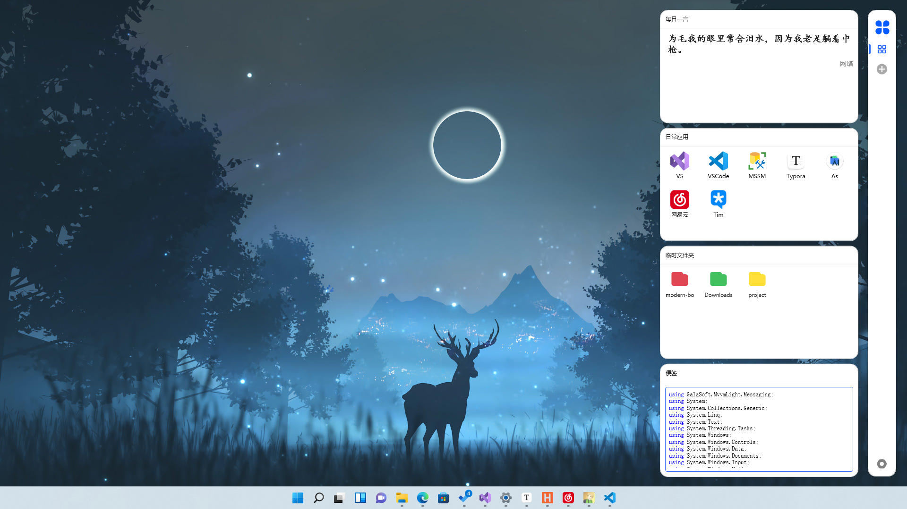

可以通过右键日常应用卡片快速添加你的应用，也可以采用自定义的图标

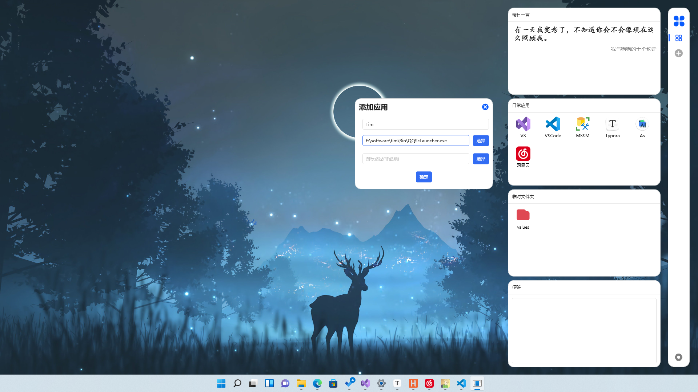

可以通过右键临时文件夹的方式，快速的添加你想要快速访问的文件夹，并且可以定义它们的重要级别红色为最重要依次类推

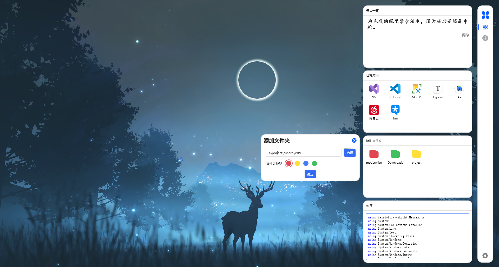

这里是设置界面目前还没有写完，所以可div性比较小

可以通过设置界面更换你的卡片应用出现的方向现在是在左边

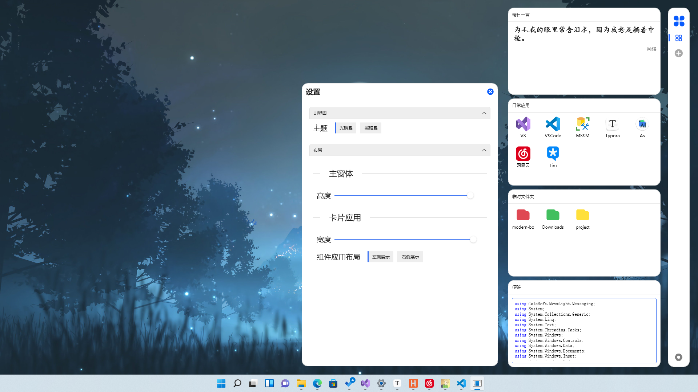

现在是在左面灵活的适用于桌面的左右

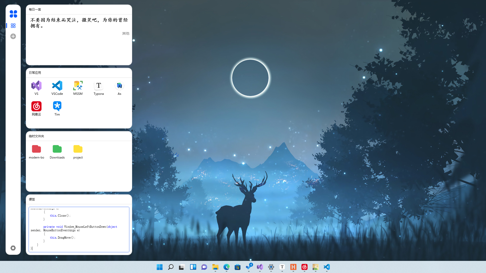

## 更新

##### 2021/11/7 更新

内容：文件卡片，文件属性,支持大量文件格式的图标

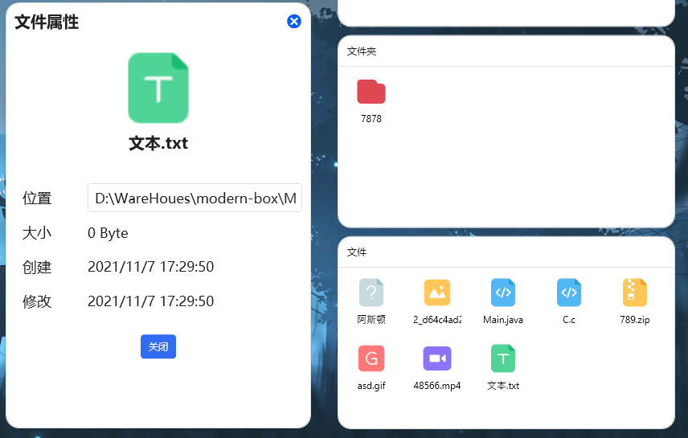

##### 2021/11/8 修复部分细节问题，增加空状态太空人图，提升体验

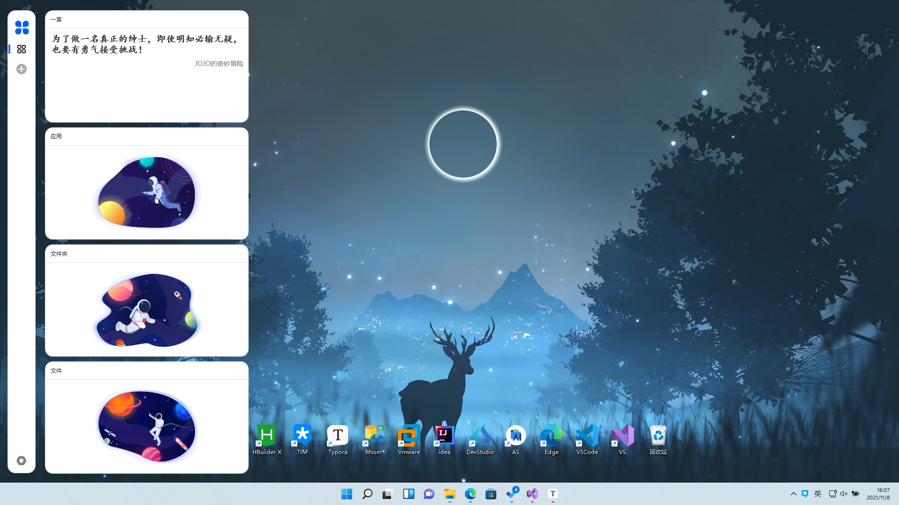

##### 2021/11/10 修复已知问题，增加自定义卡片应用的功能,可以添加自己需要的卡片应用，同样也可以调节卡片的高度

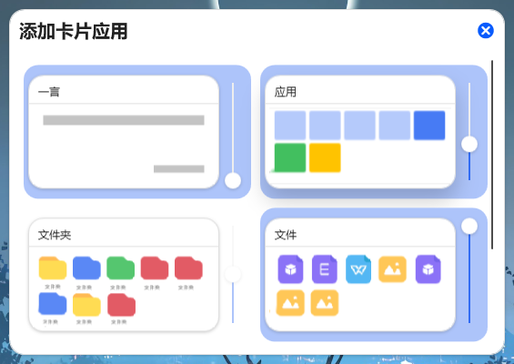

##### 2021/11/11 更新内容如下

###### UI界面修改

1. 修改卡片的圆角

###### 操作修改

1. 支持通过拖动的方式添加应用，文件夹，文件到相应的卡片中

2. 新增移除菜单选项（并不会删除源文件，删除选项会删除源文件）

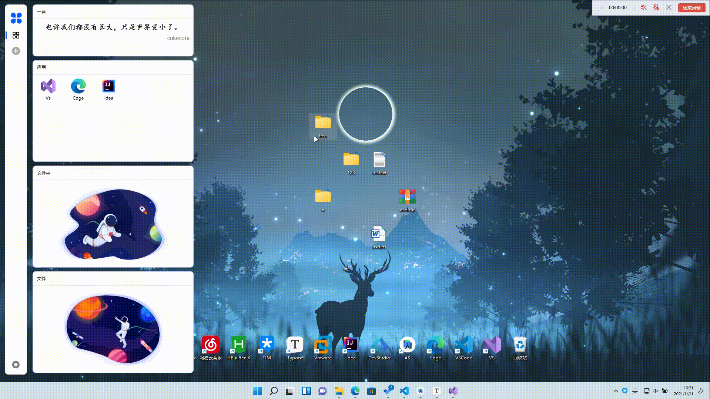

##### 2021/11/12

修复添加因添加卡片导致的程序崩溃问题，增加实时添加修改卡片功能

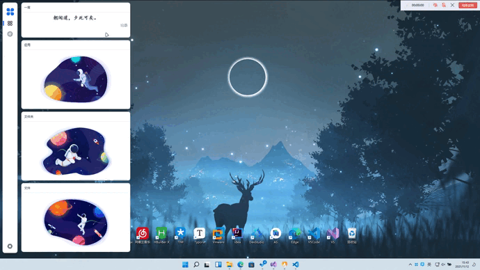

**如果你喜欢这个项目请给予我一些支持，一个小小的Star足矣**

**项目支持：HandyControl**
